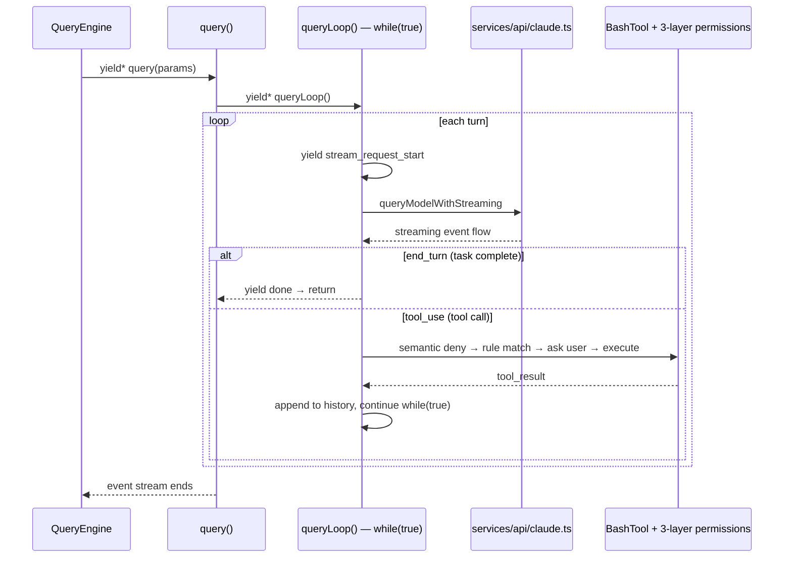

# P2: Core Loop

[中文](./p2-core-loop.md) | English

## Best For

- Readers who finished P1 and are ready for Claude Code’s actual heart
- Readers who want to connect “mode routing” to “how one request really runs”

## Time

90-120 minutes

## What This Stage Should Understand

This stage narrows the work to the three things inside the single-turn mainline:

1. how one request becomes the control rhythm inside `query` / `queryLoop`
2. how model output, tool call, tool execution, and `tool_result` flow back into one loop
3. why permissions and streaming become important exactly here

## Where You Are On The Mainline

**Mainline position:** enter `query` / `queryLoop` → model output → tool call → tool execution → tool result flows back → next turn or exit



Unlike P1, this page is now inside the real request mainline.

Your job here is not to memorize features. It is to see why one request advances in this order:

- `query` / `queryLoop` drives the turn
- the model returns text or a tool call
- tool execution results must re-enter message history
- streaming and permissions determine whether the turn can keep moving safely

## Which Example To Run First

Keep `l2_agent_loop.py` as the main anchor:

```bash
python examples/l2_agent_loop.py
```

With an API key, then add the supporting boundaries:

```bash
python examples/l7_permissions.py
python examples/l8_streaming.py
```

Without an API key, at least run:

```bash
python examples/l7_permissions.py
```

Do not let `l7` or `l8` steal the spotlight. They support the mainline; they do not replace `l2`.

## Which Layer To Read Next

Read in this order:

1. [L2 Agent Loop](../layers/l2-agent-loop.en.md)
2. [Source Map: single-turn query path](../source-map.en.md#2-single-turn-query-path)
3. [Example-To-Source Bridge: l2 / l7 / l8](../example-source-bridge.en.md)

Only after the mainline feels stable, add:

4. [L7 Permissions](../layers/l7-permissions.en.md)
5. [L8 Streaming](../layers/l8-streaming.en.md)

## Which Source Files To Open Next

Open these three mainline files first:

- `claudecode_src/src/query.ts` — where `query` / `queryLoop` drives the single-turn loop
- `claudecode_src/src/QueryEngine.ts` — where session orchestration supports the turn
- `claudecode_src/src/services/api/claude.ts` — where model streaming becomes higher-level events

After the mainline connects cleanly, add one tool boundary:

- `claudecode_src/src/tools/BashTool/bashPermissions.ts`
- `claudecode_src/src/tools/BashTool/bashSecurity.ts`

## What To Ignore For Now

Deliberately ignore these branches for now:

- prompt cache and memory
- MCP / hooks / plugins extension surfaces
- multi-agent / structured output
- deep REPL UI state organization
- do not read every tool registration detail yet; follow only the boundary required for one turn

This page is about locking in the single-turn spine, not expanding to the whole system map too early.

## Recommended Reading Order

Use two passes:

### Pass One: lock in the loop itself

1. `l2_agent_loop.py`
2. `L2`
3. `query.ts`
4. `QueryEngine.ts`

### Pass Two: add permissions and streaming

1. `l7_permissions.py`
2. `l8_streaming.py`
3. `L7`
4. `L8`
5. `services/api/claude.ts`

## Must-Search Symbols

- `export async function* query`
- `async function* queryLoop`
- `tool_result`
- `BASH_SECURITY_CHECK_IDS`
- `stream_request_start`
- `queryModelWithStreaming`
- `first_chunk`

## Only Answer These Three Questions

1. Why is Claude Code’s core abstraction closer to “state machine plus event stream” than a normal `while` loop?
2. Why must tool results be appended back into message history instead of being printed and discarded?
3. Why do permissions and streaming belong inside the main call chain instead of hanging off the side?

## Recommended Exercises

- [Exercise 1: trace one minimal call chain](../exercises.en.md)
- [Exercise 3: tools and permissions boundary](../exercises.en.md)
- [Exercise 4: streaming events](../exercises.en.md)

## Exit Criteria

By the end of this page, you should be able to:

- explain the basic rhythm of one turn driven by `query.ts`
- explain how model output, tool execution, and `tool_result` form one loop
- describe where permission checks, streamed events, and loop exit conditions each live
- know clearly that memory and later architectural branches are not the focus yet

If you cannot, go back to:

- `L2` if `query` and `queryLoop` are still blurred together
- `L7` if security checks and user approval still feel like one thing
- `L8` if you still think streaming only means “print tokens as they arrive”

## Next Step

Continue to [P3 Source Reading](./p3-source-reading.en.md)
