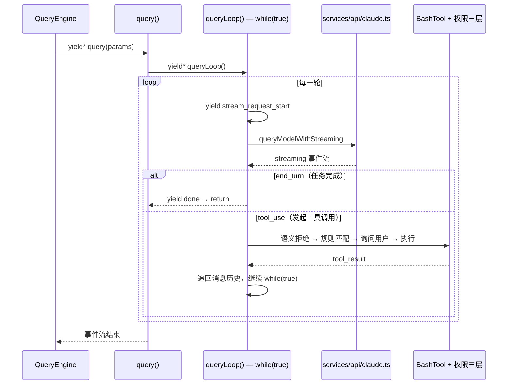

# P2：Core Loop

[English](./p2-core-loop.en.md) | 中文

## 适合谁

- 已完成 P1，准备理解 Claude Code 真正心脏的人
- 想把“入口分流”接到“一轮请求怎么跑”的读者

## 预计时间

90-120 分钟

## 本阶段只搞懂什么

这一阶段只抓住单轮主线里的三件事：

1. 一轮请求如何在 `query` / `queryLoop` 中形成主循环节奏
2. 模型产出、工具调用、工具执行、`tool_result` 回流如何串成闭环
3. permissions / streaming 为什么会在这一层变得重要

## 你在主线中的位置

**主线位置：** 进入 `query` / `queryLoop` → 模型产出 → 工具调用 → 工具执行 → 工具结果回流 → 下一轮或退出



和 P1 不同，这一页已经正式进入请求主线本体。

你现在要看清的不是”系统有哪些功能”，而是一次请求为什么会按这个顺序推进：

- `query` / `queryLoop` 驱动一轮
- 模型返回文本或工具调用
- 工具执行结果必须重新进入历史
- streaming 和 permissions 在这里决定这一轮能否继续安全推进

## 先跑哪个 example

先把 `l2_agent_loop.py` 作为主轴：

```bash
python examples/l2_agent_loop.py
```

有 API Key 时，再补两条边界：

```bash
python examples/l7_permissions.py
python examples/l8_streaming.py
```

没有 API Key 时，至少跑：

```bash
python examples/l7_permissions.py
```

不要让 `l7` / `l8` 抢走主角位置：它们是补边界，不是替代 `l2`。

## 再读哪篇 layer

按这条顺序读：

1. [L2 Agent 核心循环](../layers/l2-agent-loop.md)
2. [源码导图：单轮查询主链路](../source-map.md#2-单轮查询主链路)
3. [example 到源码的桥接页：l2 / l7 / l8](../example-source-bridge.md)

当 `l2` 主线站稳之后，再补：

4. [L7 权限系统](../layers/l7-permissions.md)
5. [L8 Streaming](../layers/l8-streaming.md)

## 再开哪些源码文件

这一阶段优先开这三个主线文件：

- `claudecode_src/src/query.ts` —— 看 `query` / `queryLoop` 如何驱动单轮主循环
- `claudecode_src/src/QueryEngine.ts` —— 看单轮执行中的会话 orchestration
- `claudecode_src/src/services/api/claude.ts` —— 看模型 streaming 如何变成上层事件流

当主线已经连起来后，再补一条工具边界：

- `claudecode_src/src/tools/BashTool/bashPermissions.ts`
- `claudecode_src/src/tools/BashTool/bashSecurity.ts`

## 这一阶段先不要看什么

现在先主动忽略这些分支：

- prompt cache 和 memory
- MCP / hooks / plugins 扩展面
- multi-agent / structured output
- REPL 的深层 UI 状态组织
- 不要先把所有工具注册细节全部读完，只追当前单轮需要的边界

这一页的目标是把单轮主线钉死，不是提早展开整个系统地图。

## 推荐阅读顺序

建议分两遍：

### 第一遍：先抓 loop 本身

1. `l2_agent_loop.py`
2. `L2`
3. `query.ts`
4. `QueryEngine.ts`

### 第二遍：再补 permissions 和 streaming

1. `l7_permissions.py`
2. `l8_streaming.py`
3. `L7`
4. `L8`
5. `services/api/claude.ts`

## 必搜符号

- `export async function* query`
- `async function* queryLoop`
- `tool_result`
- `BASH_SECURITY_CHECK_IDS`
- `stream_request_start`
- `queryModelWithStreaming`
- `first_chunk`

## 这一阶段只回答三个问题

1. 为什么 Claude Code 的核心抽象更像“状态机 + 事件流”，而不是普通 `while`？
2. 为什么工具结果必须追回消息历史，而不是临时打印完就丢掉？
3. 为什么 permissions 和 streaming 都必须进入主调用链，而不是挂在外面？

## 推荐练习

- [练习 1：追一条最小调用链](../exercises.md)
- [练习 3：工具和权限边界](../exercises.md)
- [练习 4：streaming 事件](../exercises.md)

## 完成标准

完成这一页时，你应该能：

- 解释 `query.ts` 驱动一轮调用的基本节奏
- 说清模型输出、工具执行、`tool_result` 回流是如何连成一圈的
- 说清权限检查、流式事件、loop 退出条件各自处在什么层
- 明确知道 memory / runtime branches 还不是这一阶段的重点

如果还说不清，先回去补：

- `L2`，如果你还分不清 `query` 和 `queryLoop`
- `L7`，如果你还把 security check 和 user approval 混在一起
- `L8`，如果你还把 streaming 理解成“边输边打印”

## 下一步

继续去 [P3 源码阅读](./p3-source-reading.md)
